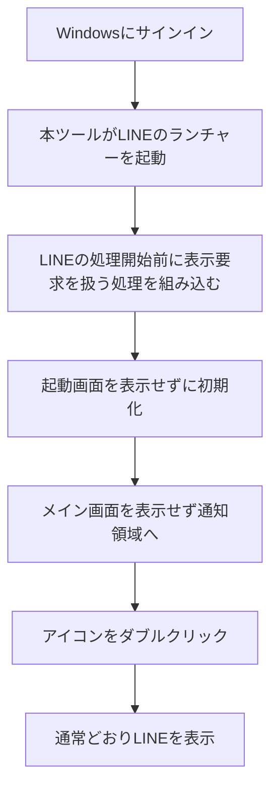

# LINE Tray Startup

**PC起動時、LINEの画面を出さずに通知領域へ。**

Windowsへのサインイン時にLINEを起動し、時計の近くにある通知領域（タスクトレイ）へ常駐させる非公式ツールです。LINEを開きたいときは、通知領域のアイコンをダブルクリックします。

**[セットアップEXEをダウンロード](https://github.com/hinatamaxxx/line-startup-to-tray/releases/download/v0.2.0-preview.1/LineTrayStartup-Setup-0.2.0-preview.1.exe)** · [リリース一覧](https://github.com/hinatamaxxx/line-startup-to-tray/releases)

> 現在は **v0.2.0-preview.1（プレビュー版）** です。Windows 11 x64・LINE 26.4.2.3957で、非表示起動、アイコンからの再表示、ログイン維持を確認しています。**PC再起動を伴う最終確認は未実施**です。すべてのLINEバージョンでの動作を保証するものではありません。

## セットアップ：3ステップ

### 1. LINEを準備する

- Windows版LINEをインストールし、ログインしておきます。
- LINE本体の設定で **自動ログインをON** にします。
- LINE本体の自動起動設定を事前に変更する必要はありません。重複起動を防ぐ設定はセットアップが行います。
- 時計の近くのLINEアイコンを右クリックして **「終了」** します。アイコンが見当たらない場合は、通知領域の **「^」** を開いてください。

**ウィンドウ右上の「×」だけでは終了しません。**

### 2. セットアップEXEを開く

上のダウンロードリンクから `LineTrayStartup-Setup-0.2.0-preview.1.exe` を保存し、ダブルクリックします。画面の **「セットアップ」** を押し、完了表示を待ってください。

- 管理者権限、コマンド入力、GitやVisual Studioのインストールは不要です。
- 必要なファイルはセットアップEXEに含まれています。セットアップ中の追加ダウンロードはありません。
- GitHubのリリースページから選ぶ場合は、**Assets内のセットアップEXE** をダウンロードします。`Source code (zip)` は開発者向けです。

### 3. 動作を確認する

セットアップ画面の **「LINEを起動」** を押してください。

1. LINEの画面が出ず、通知領域にアイコンが現れることを確認します。
2. アイコンをダブルクリックし、LINEが開いてログイン状態が維持されていることを確認します。
3. 都合のよいときにPCを再起動し、サインイン後も同じように起動することを確認してください。

以後、セットアップを毎回開く必要はありません。Windowsへのサインイン時に自動で起動します。

## 毎日の使い方

| やりたいこと | 操作 |
| --- | --- |
| LINEを開く | 通知領域のLINEアイコンをダブルクリック |
| LINEを終了する | 通知領域のアイコンを右クリック →「終了」 |
| セットアップ画面を開く | スタートメニューで **LINE Tray Startup** を検索 |
| 手動で非表示起動を試す | LINEを終了後、セットアップ画面の「LINEを起動」 |

LINEの自動ログイン設定は、引き続きLINE本体で管理します。通常のLINEショートカットから起動した場合は、本ツールを通さず通常どおり開きます。

## どうやって画面を出さずに起動するの？

LINEがWindowsに **「このウィンドウを表示して」** と依頼するタイミングで、その表示要求を処理します。

起動画面は表示せずに初期化を進めます。メイン画面も最初の表示を抑えたまま、LINE本来の「閉じる」処理を呼び、通知領域へ移します。その後は通常の表示操作を許可するため、アイコンをダブルクリックすればLINEを開けます。

### 実装のポイント

- **表示する前に処理します。** ウィンドウが出るのを一定間隔で探す監視ループや、時間を決めて待つ処理は使っていません。
- **LINE本来のランチャーを使います。** `LineLauncher.exe --booting` を呼び出し、ランチャーから本体への起動にも処理を引き継ぎます。
- **メモリ上に補助処理を組み込みます。** Microsoftの[Detours](https://github.com/microsoft/Detours)を使い、Windowsの表示APIを呼ぶ経路に補助DLLを入れます。この仕組みを「フック」と呼びます。ディスク上のLINE実行ファイルは変更しません。
- **常駐監視用の別プロセスは残しません。** 起動用EXEは処理後に終了し、補助DLLはLINEのプロセス内に残ります。
- **通知領域のアイコンにもLINE本体のものを使います。** PCにインストールされているLINEからアイコンを取得します。LINE本体やそのアイコン画像を本ツールに同梱して再配布することはありません。

より詳しい処理の流れとソースコードの対応は、[実装の説明](docs/architecture.md)をご覧ください。

## 対応環境と制約

| 項目 | 内容 |
| --- | --- |
| 対象OS | Windows 10 / 11、x64。実機確認はWindows 11 Home 23H2 |
| LINE | `%LOCALAPPDATA%\LINE\bin\LineLauncher.exe` があるデスクトップ版 |
| 確認済みLINE | **26.4.2.3957**。ほかのバージョンは未確認 |
| Windows ARM / 32bit OS | 対象外 |
| 権限 | 現在ログインしているユーザーに導入。管理者権限は不要 |

- LINEの更新で内部構造が変わると、動作しなくなる場合があります。
- 通知領域アイコンを固定するため、アイコン上の未読バッジなどが反映されない場合があります。
- LINE自体の認証切れを防ぐツールではありません。再認証が必要な場合は、LINEを開いてログインしてください。
- セットアップは二重起動を防ぐため、Windows側の通常のLINEスタートアップ項目を無効にし、本ツールの項目を有効にします。**通常のLINE項目を再び有効にすると、画面が出る原因になります。**

## 更新する

1. 通知領域のメニューからLINEを「終了」します。
2. 新しいリリースのセットアップEXEをダウンロードして開きます。
3. 「セットアップ」を押すと新しい版に更新されます。初回導入前の自動起動設定のバックアップは自動で引き継ぎます。

以前のPowerShell版を使っていた場合、同じ名前の旧タスク `LINE startup to tray` はセットアップ時に削除します。旧スクリプトがまだ動いている場合は、一度Windowsからサインアウトしてください。

## 元に戻す・削除する

1. スタートメニューの **LINE Tray Startup**、またはダウンロードしたセットアップEXEを開きます。
2. **「設定を元に戻す」** を押します。
3. LINEを通知領域から「終了」し、通常のLINEショートカットから起動し直します。

自動起動設定を導入前の状態へ戻し、セットアップ画面へのスタートメニュー項目を削除します。LINE本体やログイン情報は削除しません。

本ツールのファイルも削除したい場合は、セットアップ画面の **「保存先を開く」** を押し、LINEとセットアップを終了してから、開いた `LineTrayStartup` フォルダーを削除してください。保存先は `%LOCALAPPDATA%\LineTrayStartup` です。

## 困ったとき

### 「LINEが起動しています」と表示される

LINEのウィンドウを閉じるだけでなく、通知領域のアイコンを右クリックして「終了」してください。その後、もう一度「セットアップ」を押します。

### 「LINEのランチャーが見つかりません」と表示される

デスクトップ版LINEが必要です。上の「対応環境」に記載した場所にインストールされているか確認してください。別の場所にインストールしたLINEは、この版では自動検出できません。パスを確認するときは、エクスプローラーのアドレスバーに `%LOCALAPPDATA%\LINE\bin` と入力します。Microsoft Storeから導入した版の動作は未確認です。

### ダウンロードしたEXEについてWindowsの警告が出る

現在の配布EXEにはコード署名がありません。Windowsが発行元を確認できない旨を表示する場合があります。入手元がこのリポジトリのReleasesであることを確認してください。リリースには照合用の `SHA256SUMS.txt` も添付していますが、通常の利用ではダウンロード不要です。**ウイルス対策機能の無効化や除外設定は必要ありません。**

### 再起動するとLINEの画面が出る

Windowsの「設定 → アプリ → スタートアップ」で、**LineTrayStartupがON、通常のLINEがOFF** になっているか確認してください。LINE更新後に発生した場合は、リリースの対応バージョンも確認します。解決しない場合は「設定を元に戻す」で通常起動へ戻せます。

### 起動しない・通知領域にアイコンがない

「^」の中も確認してください。見当たらない場合は通常のLINEショートカットから起動できます。問題が続く場合は、セットアップ画面の「設定を元に戻す」を使用してください。

[不具合を報告](https://github.com/hinatamaxxx/line-startup-to-tray/issues)する際は、WindowsとLINEのバージョン、どの操作で起きたかを添えてください。診断ログは保存先の `diagnostic.log` です。処理名・プロセスID・ウィンドウクラス・数値を記録し、会話本文や認証情報は記録しません。`startup-backup.json` にはユーザー名を含むパスが入る場合があるため、公開の報告には添付しないでください。

## 開発者向け

自分でビルドする場合は、[ビルドとテストの手順](docs/development.md)をご覧ください。通常の利用にはビルドは不要です。

本ツールのライセンスは[MIT](LICENSE)です。Microsoft Detoursにも[MITライセンス](third_party/Detours/LICENSE.md)が適用されます。LINEの名称とロゴは権利者に帰属します。本ツールはLINE公式が提供・サポートするものではありません。
