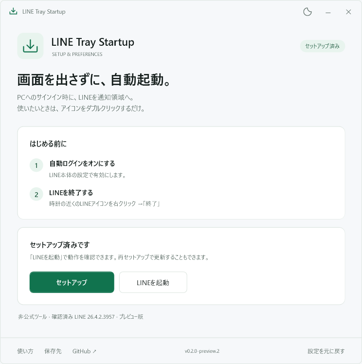
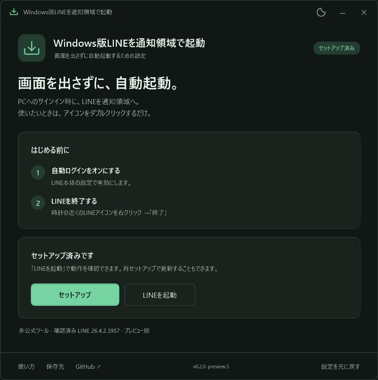
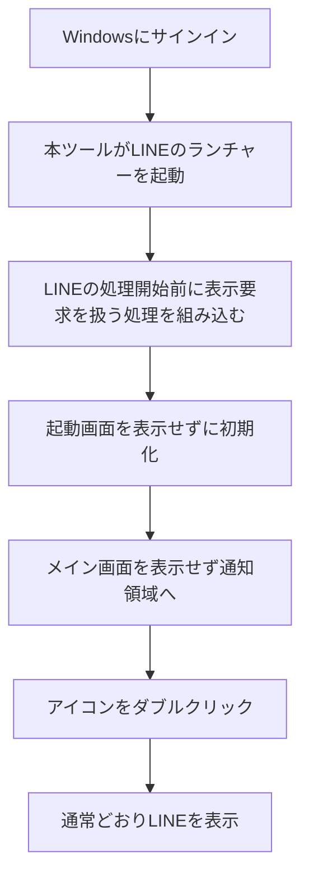

# Windows版LINEを通知領域で起動

**PC起動時、LINEの画面を出さずに通知領域へ。**

Windowsへのサインイン時にLINEを起動し、時計の近くにある通知領域（タスクトレイ）へ常駐させる非公式ツールです。LINEを開きたいときは、通知領域のアイコンをダブルクリックします。

**[セットアップEXEをダウンロード](https://github.com/hinatamaxxx/windows-line-start-to-tray/releases/download/v0.2.0-preview.5/WindowsLineStartToTray-Setup-0.2.0-preview.5.exe)** · [リリース一覧](https://github.com/hinatamaxxx/windows-line-start-to-tray/releases)

> 現在は **v0.2.0-preview.5（プレビュー版）** です。Windows 11 x64・Microsoft StoreからインストールしたLINE 26.4.2.3957で、非表示起動、アイコンからの再表示、ログイン維持を確認しています。AIツールなどから導入した際に設定とファイルが隔離領域へ保存される問題を修正し、Windowsが使う実際の保存先と起動設定を確認しました。**2026年9月30日、利用者が実機でPC再起動後もLINEのウィンドウが表示されず、通知領域にLINEのアイコンが表示されることを確認しました。** 今回の再起動後の確認では、アイコンからの再表示とログイン維持は再確認していません。すべてのLINEバージョンでの動作を保証するものではありません。

Windowsのテーマに合わせてライト／ダークで表示します。右上の月のボタンでも切り替えられます。

ダークテーマの画面を見る

## セットアップ：3ステップ

### 1. LINEを準備する

- Windows版LINEをインストールし、ログインしておきます。
- LINE本体の設定で **自動ログインをON** にします。
- LINE本体の自動起動設定を事前に変更する必要はありません。セットアップがWindowsのLINE起動項目を本ツール経由に切り替えます。
- 時計の近くのLINEアイコンを右クリックして **「終了」** します。アイコンが見当たらない場合は、通知領域の **「^」** を開いてください。

**ウィンドウ右上の「×」だけでは終了しません。**

### 2. セットアップEXEを開く

上のダウンロードリンクから `WindowsLineStartToTray-Setup-0.2.0-preview.5.exe` を保存し、ダブルクリックします。画面の **「セットアップ」** を押し、完了表示を待ってください。

- 管理者権限、コマンド入力、GitやVisual Studioのインストールは不要です。
- 必要なファイルはセットアップEXEに含まれています。セットアップ中の追加ダウンロードはありません。
- GitHubのリリースページから選ぶ場合は、**Assets内のセットアップEXE** をダウンロードします。`Source code (zip)` は開発者向けです。

### 3. 動作を確認する

セットアップ画面の **「LINEを起動」** を押してください。

1. LINEの画面が出ず、通知領域にアイコンが現れることを確認します。
2. アイコンをダブルクリックし、LINEが開いてログイン状態が維持されていることを確認します。
3. 都合のよいときにPCを再起動し、サインイン後も同じように起動することを確認してください。

以後、セットアップを毎回開く必要はありません。Windowsへのサインイン時に自動で起動します。

## 毎日の使い方

| やりたいこと | 操作 |
| --- | --- |
| LINEを開く | 通知領域のLINEアイコンをダブルクリック |
| LINEを終了する | 通知領域のアイコンを右クリック →「終了」 |
| セットアップ画面を開く | スタートメニューで **Windows版LINEを通知領域で起動** を検索 |
| 手動で非表示起動を試す | LINEを終了後、セットアップ画面の「LINEを起動」 |

LINEの自動ログイン設定は、引き続きLINE本体で管理します。通常のLINEショートカットから起動した場合は、本ツールを通さず通常どおり開きます。

## どうやって画面を出さずに起動するの？

LINEがWindowsに **「このウィンドウを表示して」** と依頼するタイミングで、その表示要求を処理します。

起動画面は表示せずに初期化を進めます。メイン画面も最初の表示を抑えたまま、LINE本来の「閉じる」処理を呼び、通知領域へ移します。その後は通常の表示操作を許可するため、アイコンをダブルクリックすればLINEを開けます。

### 実装のポイント

- **表示する前に処理します。** ウィンドウが出るのを一定間隔で探す監視ループや、時間を決めて待つ処理は使っていません。
- **LINE本来のランチャーを使います。** `LineLauncher.exe --booting` を呼び出し、ランチャーから本体への起動にも処理を引き継ぎます。
- **メモリ上に補助処理を組み込みます。** Microsoftの[Detours](https://github.com/microsoft/Detours)を使い、Windowsの表示APIを呼ぶ経路に補助DLLを入れます。この仕組みを「フック」と呼びます。ディスク上のLINE実行ファイルは変更しません。
- **常駐監視用の別プロセスは残しません。** 起動用EXEは処理後に終了し、補助DLLはLINEのプロセス内に残ります。

より詳しい処理の流れとソースコードの対応は、[実装の説明](docs/architecture.md)をご覧ください。

### 通知領域のLINEアイコンはどう設定しているの？

**PCにインストールされているLINE本体（`LINE.exe`）に埋め込まれたアイコンを読み取って使います。** 利用者が画像を用意したり、アイコンを手動で設定したりする必要はありません。

1. LINEの起動後、通知領域のアイコンが必要になった時点で、LINE本体からアイコンを取得します。
2. LINEがWindowsへ通知領域アイコンの登録・更新を要求する際、渡すアイコンを取得したものに差し替えます。
3. ダブルクリックや右クリックなどの操作は、引き続きLINE本体が処理します。

この差し替えは動作中のメモリ上で行い、**ディスク上のLINE本体やアイコンを書き換えません。LINE本体やそのアイコン画像を本ツールに同梱して再配布することもありません。** セットアップ画面には、本ツール独自のアイコンを使っています。

実装では、`ExtractIconExW` でアイコンを読み取り、`Shell_NotifyIconW` に渡すアイコンを差し替えています。取得できなかった場合は、LINEが指定した元のアイコンをそのまま使います。該当するコードは [Hook.cpp の `HookNotifyIcon`](native/Hook.cpp) にあります。

なお、取得したアイコンに固定するため、LINEが未読バッジなどをアイコン画像で表す場合、その変化が反映されないことがあります。

## 対応環境と制約

| 項目 | 内容 |
| --- | --- |
| 対象OS | Windows 10 / 11、x64。実機確認はWindows 11 Home 23H2 |
| LINE | `%LOCALAPPDATA%\LINE\bin\LineLauncher.exe` があるデスクトップ版 |
| 確認済みLINE | **Microsoft Storeからインストールした26.4.2.3957**。ほかのバージョン・配布経路は未確認 |
| Windows ARM / 32bit OS | 対象外 |
| 権限 | 現在ログインしているユーザーに導入。管理者権限は不要 |

- LINEの更新で内部構造が変わると、動作しなくなる場合があります。
- 通知領域アイコンを固定するため、アイコン上の未読バッジなどが反映されない場合があります。
- LINE自体の認証切れを防ぐツールではありません。再認証が必要な場合は、LINEを開いてログインしてください。
- セットアップはWindowsの `LINE` スタートアップ項目の起動先を本ツールへ切り替えます。旧版の別項目 `LineTrayStartup` は削除し、起動経路を1つにします。LINE本体で自動起動設定を変更すると起動先が戻る場合があるため、その際は再セットアップしてください。

## 更新する

旧名「LINE Tray Startup」を使っている方も、同じ手順で更新できます。スタートメニューの名前は「Windows版LINEを通知領域で起動」に変わります。保存先フォルダーは引き続き `LineTrayStartup` です。v0.2.0-preview.4からWindowsの自動起動は `LINE` 項目に統一し、導入前のバックアップは引き継ぎます。

1. 通知領域のメニューからLINEを「終了」します。
2. 新しいリリースのセットアップEXEをダウンロードして開きます。
3. 「セットアップ」を押すと新しい版に更新されます。初回導入前の自動起動設定のバックアップは自動で引き継ぎます。

以前のPowerShell版を使っていた場合、同じ名前の旧タスク `LINE startup to tray` はセットアップ時に削除します。旧スクリプトがまだ動いている場合は、一度Windowsからサインアウトしてください。

## 元に戻す・削除する

1. スタートメニューの **Windows版LINEを通知領域で起動**、またはダウンロードしたセットアップEXEを開きます。
2. **「設定を元に戻す」** を押します。
3. LINEを通知領域から「終了」し、通常のLINEショートカットから起動し直します。

自動起動設定を導入前の状態へ戻し、セットアップ画面へのスタートメニュー項目を削除します。LINE本体やログイン情報は削除しません。

本ツールのファイルも削除したい場合は、セットアップ画面の **「保存先を開く」** を押し、LINEとセットアップを終了してから、開いた `LineTrayStartup` フォルダーを削除してください。保存先は `%LOCALAPPDATA%\LineTrayStartup` です。

## 困ったとき

### 「LINEが起動しています」と表示される

LINEのウィンドウを閉じるだけでなく、通知領域のアイコンを右クリックして「終了」してください。その後、もう一度「セットアップ」を押します。

### 「LINEのランチャーが見つかりません」と表示される

上の「対応環境」に記載した場所にLINEがインストールされているか確認してください。動作確認に使ったMicrosoft StoreからインストールしたLINEでも、この場所に `LineLauncher.exe` があります。別の場所にインストールしたLINEは、この版では自動検出できません。パスを確認するときは、エクスプローラーのアドレスバーに `%LOCALAPPDATA%\LINE\bin` と入力します。

### ダウンロードしたEXEについてWindowsの警告が出る

現在の配布EXEにはコード署名がありません。Windowsが発行元を確認できない旨を表示する場合があります。入手元がこのリポジトリのReleasesであることを確認してください。リリースには照合用の `SHA256SUMS.txt` も添付していますが、通常の利用ではダウンロード不要です。**ウイルス対策機能の無効化や除外設定は必要ありません。**

### 再起動するとLINEの画面が出る

v0.2.0-preview.4まで、Codexなどのアプリから導入した際に、設定やファイルがそのアプリ専用の隔離領域へ保存される問題を確認しました。画面上はセットアップ済みでもWindows本体には適用されず、再起動時に通常のLINEが開く状態でした。最新のセットアップEXEで再セットアップしてください。v0.2.0-preview.5ではセットアップを通常のWindowsプロセスとして実行し、実際のユーザー設定へ登録します。

Windowsの「設定 → アプリ → スタートアップ」では、**LINEをON** にしてください。LINE本体の自動起動設定を変更した後にも再セットアップが必要になる場合があります。問題が続く場合は `diagnostic.log` の再起動後の `helper-start` と `line-hook-attached` の有無を確認して報告してください。解決しない場合は「設定を元に戻す」で通常起動へ戻せます。

### 起動しない・通知領域にアイコンがない

「^」の中も確認してください。見当たらない場合は通常のLINEショートカットから起動できます。問題が続く場合は、セットアップ画面の「設定を元に戻す」を使用してください。

[不具合を報告](https://github.com/hinatamaxxx/windows-line-start-to-tray/issues)する際は、WindowsとLINEのバージョン、どの操作で起きたかを添えてください。診断ログは保存先の `diagnostic.log` です。処理名・プロセスID・ウィンドウクラス・数値を記録し、会話本文や認証情報は記録しません。`startup-backup.json` にはユーザー名を含むパスが入る場合があるため、公開の報告には添付しないでください。

## 開発者向け

自分でビルドする場合は、[ビルドとテストの手順](docs/development.md)をご覧ください。通常の利用にはビルドは不要です。

## 開発に使用したAIモデル

このツールは、利用者の要望と実機での確認をもとに、AIコーディングツールを使って開発しました。開発記録で確認できたモデルは次のとおりです。

| 用途 | ツール | 使用モデル |
| --- | --- | --- |
| これまでの設計・実装・テスト・ドキュメント作成 | OpenAI Codex | `gpt-6-astra`、`gpt-6-sol`、`gpt-6-luna` |
| 再起動時の不具合修正 | OpenAI Codex | Astra（`gpt-6-astra`）、GPT-6.1 Sol（`gpt-6.1-sol`、Ultra / Fast） |
| 利用者向けの説明文の校正 | Antigravity CLI | Gemini 3.8 Flash (High) |

これらは開発時に使用したものです。本ツールを利用するために、AIサービスのアカウントやAPIキーは必要ありません。

本ツールのライセンスは[MIT](LICENSE)です。Microsoft Detoursにも[MITライセンス](third_party/Detours/LICENSE.md)が適用されます。LINEの名称とロゴは権利者に帰属します。本ツールはLINE公式が提供・サポートするものではありません。
